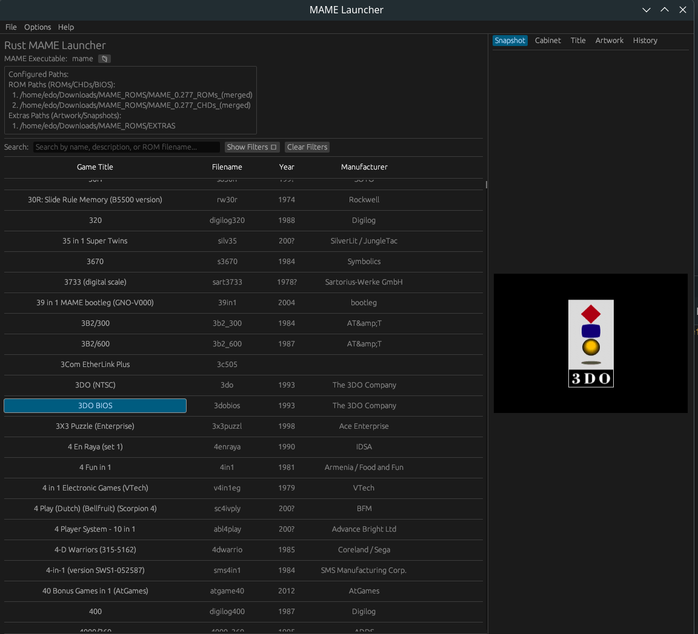

# RMAMEUI - Rust MAME Launcher

A modern MAME frontend built with Rust

Created by Edo Hikmahtiar - Indonesia



## Features

- 🎮 **Multi-folder ROM management** - Support for ROMs, CHDs, and BIOS files
- 🖼️ **Game artwork display** - View snapshots, cabinets, titles, and artwork
- 🔍 **Advanced search and filtering** - Find games quickly with powerful filters
- 📊 **MAME metadata integration** - Shows game info, manufacturer, year, etc.
- 🔒 **Content filtering** - Hide adult/casino/mahjong games
- 📈 **Statistics** - See total games and working percentage for your MAME version

## Screenshots

(Add your screenshots here)

## Installation

### Arch Linux (AUR)

```bash
# Clone and build from AUR (when available)
yay -S rust-mame-launcher
# OR manually:
git clone https://github.com/firesand/rust-mame-launcher.git
cd rust-mame-launcher
makepkg -si
```

### Other Linux Distributions

#### From Release (Recommended)

1. Download the latest release from [Releases](https://github.com/firesand/rust-mame-launcher/releases)
2. Extract and install:
```bash
tar -xzf rust-mame-launcher-0.1.0-linux-x86_64.tar.gz
cd rust-mame-launcher-0.1.0
chmod +x install.sh
./install.sh
```

#### From Source

```bash
# Clone the repository
git clone https://github.com/firesand/rust-mame-launcher.git
cd rust-mame-launcher

# Build and install
cargo build --release
sudo cp target/release/mame_gui /usr/local/bin/rust-mame-launcher

# Install desktop file
sudo cp rust-mame-launcher.desktop /usr/share/applications/
```

## Usage

1. **Set MAME executable**: File → Set MAME Executable
2. **Add ROM paths**: Options → Directories → Add ROM Path
3. **Add artwork paths**: Options → Directories → Add Extras Path
4. **Browse and launch games**: Double-click or select and click "Launch Selected ROM"

### Keyboard Shortcuts

- `Ctrl+Q` - Quit
- `Up/Down` - Navigate game list
- `Enter` - Launch selected game

## Requirements

- MAME (any recent version)
- GTK3 libraries
- Rust 1.70+ (for building from source)

## Directory Structure

```
~/.local/share/rust-mame-launcher/
├── roms/          # Your ROM files
├── chds/          # CHD files
├── artwork/       # MAME artwork zips
├── snap/          # Game snapshots
├── cabinets/      # Cabinet images
└── titles/        # Title screens
```

## Building from Source

### Prerequisites

- Rust toolchain (install from https://rustup.rs/)
- GTK3 development libraries

```bash
# Debian/Ubuntu
sudo apt install libgtk-3-dev

# Fedora
sudo dnf install gtk3-devel

# Arch Linux
sudo pacman -S gtk3
```

### Build

```bash
cargo build --release
```

## Contributing

Contributions are welcome! Please feel free to submit a Pull Request.

## TODO

- [ ] Favorites system
- [ ] Game history tracking
- [ ] Export game list
- [ ] Gamepad support
- [ ] Custom themes

## 🆕 What's New in v0.2.0

### Multi-MAME Version Support
- Manage multiple MAME installations from a single frontend
- Per-game MAME version selection with right-click menu
- Automatic preference memory for each game
- Perfect for compatibility issues where games need specific MAME versions

See the [Changelog](#changelog) for details.

## Features

- ✅ Multi-folder ROM management
- ✅ **NEW: Multiple MAME version support**
- ✅ Game artwork display (snapshots, cabinets, titles, artwork)
- ✅ Advanced search and filtering
- ✅ MAME metadata integration
- ✅ Cross-platform support (Windows, Linux, macOS)

## Usage

### Managing Multiple MAME Versions (NEW!)
1. Go to `File → MAME Executables Manager`
2. Add your different MAME installations
3. Set a default MAME version
4. Right-click any game to choose which MAME version to use

## License

This project is licensed under the MIT License - see the [LICENSE](LICENSE) file for details.

## Acknowledgments

- Built with [egui](https://github.com/emilk/egui) - immediate mode GUI library for Rust
- MAME team for the amazing emulator
- Rust community for excellent libraries and tools
